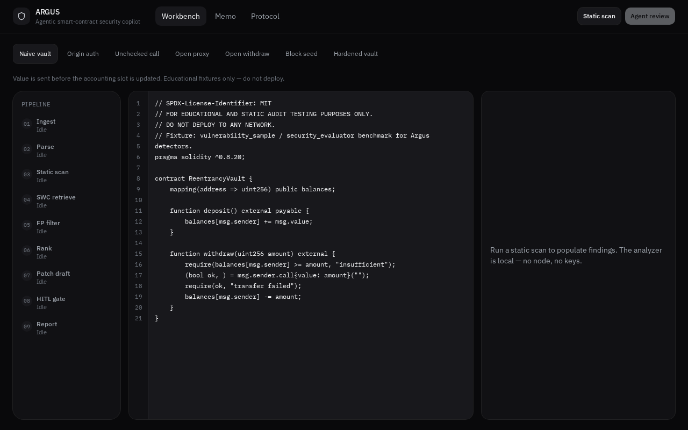
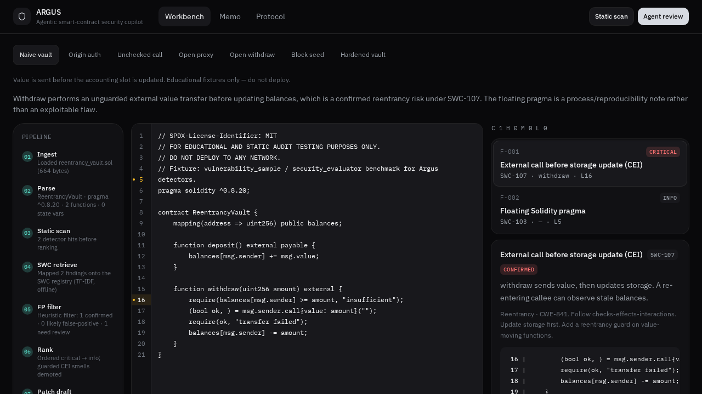
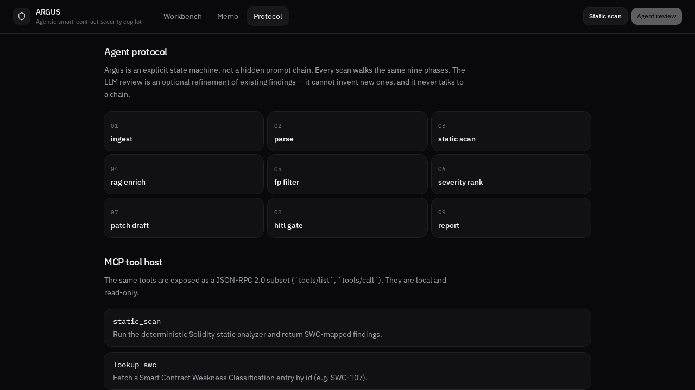

# ARGUS

Agentic smart-contract security copilot: deterministic static analysis, SWC-mapped retrieval, and a human-in-the-loop triage board.

[](https://argus-copilot.vercel.app)
[](https://github.com/devtechedge/blockchain_expert/actions/workflows/ci.yml)
[](https://nextjs.org/)
[](https://www.typescriptlang.org/)
[](LICENSE)

---

## Live Demo

**https://argus-copilot.vercel.app**

> **Status:** Vercel demo-mode. The analyzer, SWC retrieval, MCP tool host, and HITL board run in the browser. No API key. No chain RPC. Educational fixtures only — do not deploy the samples.

---

## Screenshots

| Workbench | HITL triage |
|-----------|-------------|
|  |  |

| Agent protocol |
|----------------|
|  |

---

## Features

- Deterministic Solidity static analysis (CEI / reentrancy, `tx.origin`, delegatecall, unchecked calls, unprotected withdraw, SELFDESTRUCT, weak seeds, floating pragma)
- SWC registry mapping with offline TF-IDF retrieval
- Heuristic false-positive filter (guards demote CEI smells)
- Remediation diff drafts
- Human-in-the-loop accept / dismiss / mark patched
- Markdown audit memo export
- MCP-shaped local tool host (`tools/list`, `tools/call`)
- CLI: `npm run scan -- path.sol`

This is a defensive review aid, not a professional audit and not a chain client.

---

## Tech Stack

| Layer | Technology |
|-------|------------|
| Workbench | Next.js 15 App Router, TypeScript, React 19 |
| Engine | Local TypeScript parser + detectors + TF-IDF SWC corpus |
| Agent | Explicit nine-phase state machine with trace events |
| Tools | JSON-RPC 2.0 subset (MCP-shaped, read-only) |
| Data | Educational Solidity fixtures in-repo |
| Hosting | Vercel demo-mode (client-side analyzer) |
| CI | GitHub Actions — `npm ci`, unit tests, typecheck. No RPC. |

---

## Quick Start

```bash
npm install
npm test
npm run scan -- benchmarks/educational_samples/reentrancy_vault.sol
npm run dev
```

Open [http://localhost:3000](http://localhost:3000). Pick a fixture, run **Static scan**, then Accept / Dismiss on the board.

Optional local LLM review uses `XAI_API_KEY` from `.env.example`. The public demo does not.

---

## Agent protocol

```
INGEST → PARSE → STATIC_SCAN → RAG_ENRICH → FP_FILTER
       → SEVERITY_RANK → PATCH_DRAFT → HITL_GATE → REPORT
```

See [docs/ARCHITECTURE.md](docs/ARCHITECTURE.md). Educational samples live in `benchmarks/educational_samples/` and are labeled do-not-deploy.

---

## License

MIT. See [LICENSE](LICENSE).
